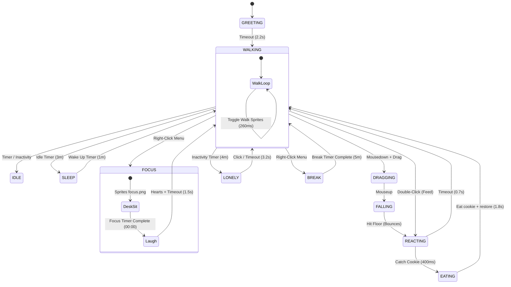
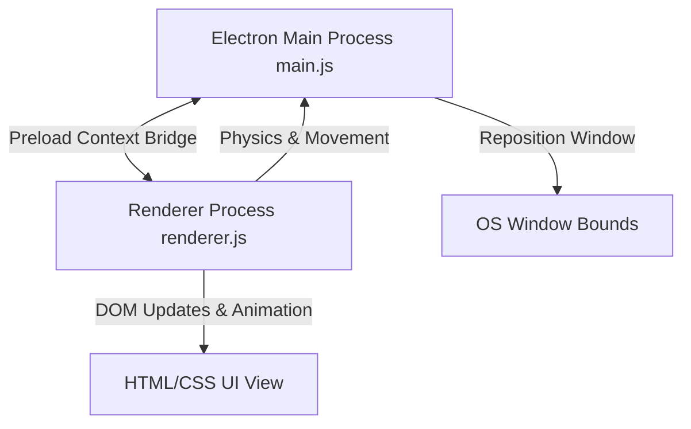

# Mini Me 🎀

A premium, cozy, and highly interactive animated desktop companion built on Electron. Mini Me lives on your screen, wanders along your taskbar, keeps you company while you work, and helps you stay mindful and productive with built-in Focus and Break sessions.

---

<p align="center">
  
  
  =18.0.0-339933?style=for-the-badge&logo=node.js" alt="Node.js Support" />
  
</p>

<p align="center">
  
  
</p>

## 📸 Preview

<p align="center">
  <!-- Place your hero screen/GIF here! -->
  
  <br>
  <em>Mini Me sitting on your taskbar, ready to pair-program with you!</em>
</p>

---

## 📖 Table of Contents

1. [Philosophy](#-philosophy)
2. [Features](#-features)
3. [Controls & Interactions](#-controls--interactions)
4. [State Machine & Pet Behaviors](#-state-machine--pet-behaviors)
5. [Technical Architecture](#-technical-architecture)
6. [Security Model](#-security-model)
7. [Performance Philosophy](#-performance-philosophy)
8. [Customization Guide](#-customization-guide)
9. [Packaging & Distribution](#-packaging--distribution)
10. [Troubleshooting](#-troubleshooting)
11. [FAQ](#-faq)
12. [Roadmap](#-roadmap)
13. [Contributing](#-contributing)
14. [Code Style Guidelines](#-code-style-guidelines)
15. [License & Usage Guidelines](#-license--usage-guidelines)
16. [Credits](#-credits)
17. [About the Author](#-about-the-author)

---

## 🕯️ Philosophy

In a digital workspace dominated by dense spreadsheets, continuous code compilation, and terminal interfaces, developers and creators are often isolated. **Mini Me** is born out of a desire to humanize the desktop environment. 

Mini Me acts as a cozy productivity companion that bridges:
- **Emotional Interaction**: A companion that gets lonely, sleeps, eats, and smiles back at you.
- **Productivity & Focus**: Incorporating time-tested techniques (like Pomodoro timers) directly into the companion's visual state.
- **Mindfulness**: Providing warm, cozy messages that remind you to relax your shoulders, take deep breaths, and stay hydrated.
- **Playful Interactivity**: Supporting simple physics interactions like dragging, falling, and feeding cookies to break the monotony of the workday.

---

## ✨ Features

- 🚶 **Taskbar Wanderer** — Walks left and right along the floor/taskbar of your screen, remaining on top of other windows.
- 💬 **Cozy & Mindful Conversations** — Periodic cozy check-ins, reminders to stretch, drink water, and coding inspiration.
- 🎯 **Focus Sessions** — Turn on Focus Mode. She sits at her tiny desk (`focus.png`) with a glowing, colorful progress bar while you zone out, distraction-free.
- ☕ **Break Sessions** — Reward yourself with a break! She walks around happily while you stretch.
- 😴 **Automatic Naps** — Takes short, adorable snoozes every few minutes of walking/idle time (automatically disabled during focus sessions).
- 🍪 **Interactive Feeding** — Double-click to drop a cookie; she catches it in her hands, reacts with hearts, and eats it happily.
- 🪂 **Drag & Drop Physics** — Pick her up and toss her around; she drops back down to the taskbar with a smooth gravity-style deceleration.
- 🥺 **Crying State (Lonely State)** — If she is left alone without clicks, drags, or treats for 4 minutes, she gets lonely, cries, and asks for your attention.
- ⚙️ **Fully Customizable** — Tweak her walking speed, size, dialogue lines, and timer durations in one place.

---

## 🎮 Controls & Interactions

Interact with Mini Me to keep her happy and engaged:

| Control | Action | Result |
| :--- | :--- | :--- |
| **Single Click** | Interact | Instant cozy message or motivational quote |
| **Double-Click** | Feed | Cookie falls from above (`treat.png`); she catches and eats it with hearts |
| **Left-Click + Drag** | Pick Up | She switches to `drag.png` and follows your cursor |
| **Release Drag** | Drop | Falls back to the taskbar under gravity (`falling` state), bouncing when she lands |
| **Right-Click** | Context Menu | Open menu to toggle Focus, Break, speech frequency, or Quit |

---

## 🧠 State Machine & Pet Behaviors

Mini Me's actions are driven by a state-machine that updates in the rendering cycle. Here are the available states:



- **Walking**: Alternates walk-1 and walk-2 sprites, moving horizontally along the floor.
- **Sleeping**: Renders sleeping sprite, spawning floating "Zzz" particles; wakes up automatically.
- **Focus**: Triggered via native context menu; sits quietly at a study desk while counting down your pomodoro block.
- **Break**: Walk speed is maintained while displaying cozy break messages.
- **Eating**: Consumes a treat and displays hearts after a cookie is caught.
- **Crying**: Swings into crying animation, displaying a lonely bubble message.
- **Laughing**: Celebratory completed-focus state that spawns hearts.
- **Dragging**: Follows your cursor with custom grab cursor and drag sprite.
- **Falling**: Falling under simulated gravity ($2200\text{ px/s}^2$) with a bounce on landing.

---

## 🏗️ Technical Architecture

Instead of rendering a giant, transparent window covering your whole monitor (which breaks click-through hit-testing and slows down your PC), Mini Me runs in a **small, frameless, transparent OS window** (240x270 px) that stays always-on-top.



- **`main.js`**: Creates the transparent window, configures Electron security settings, handles native menus, and moves the actual OS window across the monitor.
- **`preload.js`**: Creates a safe, isolated context bridge (`window.petAPI`) to let the renderer communicate window positions and menu actions without exposing Node internals.
- **`renderer.js`**: Handles the entire companion brain: physics tick loop, walking boundary bouncing, click/drag/feed interactions, states, animations, and speech timers.
- **`styles.css`**: Defines fonts, colors, smooth layout bounds, speech bubble CSS triangles, and the keyframe animations for floating particles.

---

## 🔒 Security Model

Security is critical when deploying desktop apps. Electron applications running locally have access to node capabilities that could be exploited if malicious scripts are injected.

To mitigate this, Mini Me implements a **strict security separation**:
1. **Context Isolation (`contextIsolation: true`)**: The JavaScript execution context of the renderer is separated from the preload script. This prevents the renderer from tampering with internal Electron APIs.
2. **Disabled Node Integration (`nodeIntegration: false`)**: The renderer page runs like a sandboxed webpage and cannot call `require('fs')` or other raw Node modules directly.
3. **Preload Context Bridge**: Only explicit, safe, and parameter-validated methods are exposed to the renderer under `window.petAPI` (e.g. `moveWindow(x,y)`). The renderer can never call `ipcRenderer.send()` with arbitrary events.

---

## ⚡ Performance Philosophy

Most desktop pets use a full-screen transparent canvas overlays. However, this creates several performance issues:
- Continuous rendering of a giant transparent screen consumes massive GPU memory.
- In Windows and macOS, full-screen transparent windows intercept clicks intended for background apps unless complex, unstable mouse-forwarding APIs are queried.
- System resources are wasted rendering blank pixels.

**Mini Me's approach**: Keep the window bounds small (240x270 px) and move the window itself.
- High performance: Rendering a small window takes minimal CPU and GPU cycles.
- OS Native: Uses OS-level window movement APIs which are extremely fast and hardware-accelerated.
- True Click-Through: Background windows are naturally clickable because there is no transparent window covering them!

---

## ⚙️ Customization Guide

All variables that govern Mini Me live at the top of [renderer.js](file:///c:/coding/mini-me/renderer.js) in the `CONFIG` object:

```js
const CONFIG = {
  characterHeight: 150,      // Size of the pet, in pixels
  walkSpeed: 60,             // Walk speed in pixels per second
  messageFrequencyMs: 30000, // Cozy dialogue interval (30s)
  focusMinutes: 25,          // Duration of Focus session
  breakMinutes: 5,           // Duration of Break session
  sleepIntervalMinutes: 3,   // Frequency of naps
  sleepDurationMinutes: 1,   // Nap duration
  lonelyAfterMs: 4 * 60 * 1000, // Crying triggers after this long
  walkFrameMs: 260,          // Walk animation speed
};
```

To modify her speech lines, edit the message arrays directly below the `CONFIG` object:
- `COZY_MESSAGES`: Standard walking dialogue.
- `BREAK_MESSAGES`: Dialogue during break sessions.
- `FOCUS_START_MESSAGES`: Dialogues at the start of a study block.
- `FEED_MESSAGES`: Thank-you messages when fed.

---

## 📦 Packaging & Distribution

To bundle Mini Me into a production installer:

1. **Install electron-builder**:
   ```bash
   npm run dist
   ```
2. **Build Outputs**:
   - On Windows: A standalone NSIS installer will be generated in `dist/`.
   - On macOS: A `.dmg` file will be compiled in `dist/`.

Configuration settings (app icon, category, and file targets) are declared under the `build` parameter in `package.json`.

---

## 🛠️ Troubleshooting

- **Black background instead of transparency**: This usually occurs if hardware acceleration is failing or if transparency options are overridden by GPU profiles. Run the app with:
  ```bash
  electron . --disable-gpu
  ```
- **Treat doesn't drop on double-click**: Ensure you are double-clicking directly on the companion's body image. If it still doesn't drop, check if she is currently dragging or falling (as feed interaction is paused in these states).
- **She sits over an input area**: Simply left-click and drag her to another location along the taskbar.

---

## ❓ FAQ

**Q: Can I replace the character artwork?**
A: Yes! You can replace the image files in the `assets/` folder with your own designs. Keep the filenames same, and ensure your new images are square aspect ratio.

**Q: Does she work on multi-monitor setups?**
A: By default, Electron positions her on your primary display. You can customize the positioning logic in `main.js` using Electron's `screen.getAllDisplays()` API if you wish to run her on a secondary screen.

**Q: Is there any data sent to servers?**
A: No. Mini Me runs entirely locally on your machine. There is no telemetry, analytics, or external API calling.

---

## 🗺️ Roadmap

We have a long list of features planned for future updates:
- [ ] **Multiple Companion Skins** — Support choosing from a variety of pets and companions.
- [ ] **Voice Packs** — Add optional cute sound effects for eating, sleeping, and completion notifications.
- [ ] **Seasonal Outfits** — Automatically dress her up for Halloween, Christmas, or Summer holidays.
- [ ] **Steam Integration** — Steam achievements and overlay options.
- [ ] **Achievement System** — Unlock stars and titles for completing long coding sessions.
- [ ] **Plugin API** — Allow developers to write custom scripts for custom behaviors.
- [ ] **Cloud Sync** — Sync study times and settings across multiple devices.

---

## 🤝 Contributing

We welcome community contributions! Please read our [CONTRIBUTING.md](file:///c:/coding/mini-me/CONTRIBUTING.md) to understand our development, coding, and submission policies.

---

## 📄 Code Style Guidelines

- **Vanilla CSS**: Avoid CSS libraries or preprocessors; styling belongs in `styles.css`.
- **Formatting**: Semicolons are required. Use 2-space indentation for all HTML, CSS, and JS files.
- **Function Naming**: Use `camelCase` for functions and variables.
- **Documentation**: Document public functions with clear inline explanations.

---

## 📄 License & Usage Guidelines

This project is licensed under custom terms. Please see the [LICENSE](file:///c:/coding/mini-me/LICENSE) file for usage terms, inspiration rules, and attribution guidelines.

---

## 💝 Credits

- Built with [Electron](https://www.electronjs.org/).
- Character design, sprites, and animations by You.

---

## 👨‍💻 About the Author

This repository is built, designed, and maintained by **Kanneboina Shiva Kumar**. 

I am passionate about building cozy, mindful, and high-performance open-source tools. You can explore more of my work, get in touch, or follow my projects on:
- **GitHub**: [@Kanneboinashivakumar](https://github.com/Kanneboinashivakumar)

*If this project brings a small smile to your coding sessions, please consider giving it a star (⭐) on GitHub!*