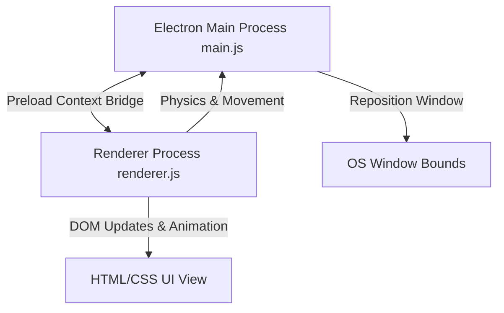

# Mini Me 🎀

A premium, cute, and highly interactive animated desktop companion built on Electron. Mini Me lives on your screen, wanders along your taskbar, keeps you company while you work, and helps you stay mindful and productive with built-in Focus and Break sessions.

---

<p align="center">
  
  
  
</p>

## 📸 Preview

<p align="center">
  <!-- Place your hero screen/GIF here! -->
  
  <br>
  <em>Mini Me sitting on your taskbar, ready to pair-program with you!</em>
</p>

---

## ✨ Features

- 🚶 **Taskbar Wanderer** — Walks left and right along the floor/taskbar of your screen, remaining on top of other windows.
- 💬 **Cozy & Mindful Conversations** — Periodic cozy check-ins, reminders to stretch, drink water, and coding inspiration.
- 🎯 **Focus Sessions** — Turn on Focus Mode. She sits at her tiny desk (`focus.png`) with a glowing, colorful progress bar while you zone out, distraction-free.
- ☕ **Break Sessions** — Reward yourself with a break! She walks around happily while you stretch.
- 😴 **Automatic Naps** — Takes short, adorable snoozes every few minutes of walking/idle time (automatically disabled during focus sessions).
- 🍪 **Interactive Feeding** — Double-click to drop a cookie; she catches it in her hands, reacts with hearts, and eats it happily.
- 🪂 **Drag & Drop Physics** — Pick her up and toss her around; she drops back down to the taskbar with a smooth gravity-style deceleration.
- 🥺 **Crying State (Lonely State)** — If she is left alone without clicks, drags, or treats for 4 minutes, she gets lonely, cries, and asks for your attention.
- ⚙️ **Fully Customizable** — Tweak her walking speed, size, dialogue lines, and timer durations in one place.

---

## 🎮 Controls & Interactions

Interact with Mini Me to keep her happy and engaged:

| Control | Action | Result |
| :--- | :--- | :--- |
| **Single Click** | Interact | Instant cozy message or motivational quote |
| **Double-Click** | Feed | Cookie falls from above (`treat.png`); she catches and eats it with hearts |
| **Left-Click + Drag** | Pick Up | She switches to `drag.png` and follows your cursor |
| **Release Drag** | Drop | Falls back to the taskbar under gravity (`falling` state), bouncing when she lands |
| **Right-Click** | Context Menu | Open menu to toggle Focus, Break, speech frequency, or Quit |

---

## 🧠 Desktop Pet Behaviors

Mini Me has a state-machine brain that governs her mood and sprites:

### 🥺 The Crying (Lonely) State
If you do not interact with Mini Me (no click, drag, or feeding) for **4 minutes** while she is walking:
1. She stops walking and switches her sprite to `crying.png`.
2. A speech bubble appears saying: `"...i missed you. click me? 🥺"`.
3. She stays in this state for a few seconds before returning to her normal walking loop.

### 🎉 The Laughing State (Focus Session Completion)
When you start a Focus Session (default **25 minutes**), she sits at her desk (`focus.png`) with a timer. When the countdown reaches `00:00`:
1. She jumps with joy and switches to `laughing.png`.
2. Floating hearts (`💗💕💖`) spawn above her head.
3. She congratulates you with a bubble: `"focus session complete! amazing work 🎉"`.
4. She automatically packs up and returns to walking.

### 🍪 The Feeding Mechanic
When you double-click her:
1. A treat element (`treat.png`) is instantiated above her head (`top: -40px`).
2. The treat falls down to her hands/mouth using `requestAnimationFrame` with a gravity-accelerating ease (`t * t`) over `650ms`.
3. The treat is consumed and she reacts with `reacting.png` and hearts.
4. She shifts into eating mode (`eating.png`) with a thank-you note before going back to her previous state.

---

## 🛠️ Installation & Setup

### Requirements
- [Node.js](https://nodejs.org) (LTS recommended)
- Windows or macOS

### Running Locally
1. Clone or download the repository to your machine.
2. Open your terminal in the project directory.
3. Install dependencies:
   ```bash
   npm install
   ```
4. Start the application:
   ```bash
   npm start
   ```

---

## 🏗️ Architecture & How It Works

Instead of rendering a giant, transparent window covering your whole monitor (which breaks click-through hit-testing and slows down your PC), Mini Me runs in a **small, frameless, transparent OS window** (240x270 px) that stays on top.



- **`main.js`**: Creates the transparent window, configures Electron security settings, handles native menus, and moves the actual OS window across the monitor.
- **`preload.js`**: Creates a safe, isolated context bridge (`window.petAPI`) to let the renderer communicate window positions and menu actions without exposing Node internals.
- **`renderer.js`**: Handles the entire companion brain: physics tick loop, walking boundary bouncing, click/drag/feed interactions, states, animations, and speech timers.
- **`styles.css`**: Defines fonts, colors, smooth layout bounds, speech bubble CSS triangles, and the keyframe animations for floating particles.

---

## ⚙️ Development & Customization

You can fully customize Mini Me's settings inside `renderer.js` in the `CONFIG` object:

```js
const CONFIG = {
  characterHeight: 150,      // Size of the pet, in pixels
  walkSpeed: 60,             // Walk speed in pixels per second
  messageFrequencyMs: 30000, // Cozy dialogue interval (30s)
  focusMinutes: 25,          // Duration of Focus session
  breakMinutes: 5,           // Duration of Break session
  sleepIntervalMinutes: 3,   // Frequency of naps
  sleepDurationMinutes: 1,   // Nap duration
  lonelyAfterMs: 4 * 60 * 1000, // Crying triggers after this long
  walkFrameMs: 260,          // Walk animation speed
};
```

To modify her speech lines, edit the message arrays directly below the `CONFIG` object:
- `COZY_MESSAGES`: Standard walking dialogue.
- `BREAK_MESSAGES`: Dialogue during break sessions.
- `FOCUS_START_MESSAGES`: Dialogues at the start of a study block.
- `FEED_MESSAGES`: Thank-you messages when fed.

---

## 📦 Packaging for Distribution

To build a standalone installer (`.dmg` on macOS, `.exe` on Windows) to share:

```bash
npm run dist
```
The finished installers will be located in the generated `dist/` directory.

---

## 🤝 Contributing

Contributions are welcome! Please follow these guidelines:
1. Fork the repository.
2. Create a new branch for your feature (`git checkout -b feature/amazing-feature`).
3. Commit your changes with clear, professional messages.
4. Push to the branch and open a Pull Request.

---

## 📄 License & Usage Guidelines

This project is licensed under custom terms. Please see the [LICENSE](file:///c:/coding/mini-me/LICENSE) file for usage terms, inspiration rules, and attribution guidelines.

---

## 💝 Credits

- Built with [Electron](https://www.electronjs.org/).
- Character design, sprites, and animations by You.